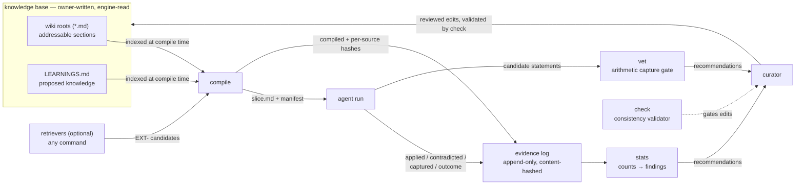

# Akela — design

**One sentence:** Akela is a deterministic compiler over rectified context — a learning layer that grows beside any markdown knowledge base, where agents *propose* what they learned from each run, evidence *gates* what holds up, and a curator *decides* what becomes knowledge.

This document is the engineering rationale: the problem, the principles, the architecture, and the reasoning behind each non-obvious decision. For the user-facing walkthrough see [how-akela-works.md](how-akela-works.md); for day-to-day usage see [guide.md](guide.md).

---

## 1 · The problem

An agent working from a knowledge base has two failure modes, and the industry only addresses one of them.

**Getting knowledge in is the solved half.** Vector stores, memory layers, retrieval pipelines — every agent-memory tool ships some version of *extract, store, retrieve*. **Getting wrong knowledge out is the unsolved half.** Knowledge bases rot: thresholds change, policies update, yesterday's correct rule becomes today's confident error. A store-and-retrieve layer has no concept of a fact being *wrong* — a stale rule keeps getting retrieved on reputation (similarity, recency, frequency) forever.

Two common workarounds make the rot invisible rather than fixing it:

- **Stuff everything into context.** With the old rule and the new rule side by side, a strong model usually picks the new one — so accuracy looks fine while the knowledge base decays underneath. The stale rule is one attention slip away from resurfacing, no metric shows how much of the context is rot, and nothing in the loop ever gets *cleaner*.
- **Let retrieval paper over it.** A retrieved correction keeps answers right, which removes the failure signal, which means the stale source underneath is never distrusted, never fixed, and outlives everyone's memory of why it's wrong.

The problem Akela solves: **a knowledge base that can be wrong and recover** — where every piece of knowledge carries a live evidence record, failing knowledge is flagged by counting rather than vibes, corrections have a first-class path in, dead knowledge provably stops appearing, and every one of those movements is auditable after the fact.

## 2 · Design principles

Each principle is load-bearing; the decisions in §5 all trace back to one of these.

1. **Count everything, decide nothing.** The engine reads, packs, and counts. It never writes the knowledge base — not one character. Every change to knowledge is a deliberate edit by a curator (a person, or an agent whose edits are reviewed), informed by the counts. This is the safety boundary *and* the audit boundary: a system that can't write can't drift behind your back, and every writer you add is an injection surface you now own.

2. **Deterministic everything.** No LLM step, no embeddings, no randomness anywhere in selection, evidence, or gating. Same inputs → same slice, byte for byte. Determinism is what makes behavior explainable ("why was this packed?" has a mechanical answer), testable (the entire engine replays offline), and diffable (when a slice changes, the cause is a visible edit or a counted event — never a hidden weight).

3. **Evidence, not similarity.** Knowledge earns or loses standing only through what runs *did* with it: `applied`, `contradicted`, or nothing. A rule is promoted because runs used it successfully, retired because runs contradicted it — never because it resembles the query or was stored recently.

4. **Evidence binds to content, not to names.** Every packed source is recorded with a content hash. Blame and credit attach to the exact text a run saw; when a section is rewritten, the new text starts with a clean record and the old text's history is set aside, still inspectable, as prior versions. An id is an address; the evidence is about the words.

5. **Constants, not configuration.** The promotion bar, the falsification window, the capture gate's thresholds — all constants in code. A tunable gate becomes an ungateable one: whoever can adjust the threshold can make the evidence say anything. Config names your world (activities, profiles, vocabularies, paths); it never touches the arithmetic.

6. **Prompts are not policies.** Any rule the system depends on is enforced by code that counts, not by a sentence that persuades. Capable models out-argue prose instructions reliably; they cannot out-argue set intersection. (The capture gate exists in its arithmetic form because the prose form — "capture only what the wiki doesn't already say" — measurably failed, and failed *harder* with more capable models.)

7. **Loud failures, honest manifests.** A refusal is an error with a reason, never a silent no-op. Every compile writes a manifest of what was packed *and what was dropped, and why* — so absence is as auditable as presence. A guardrail that silently discards good input is worse than no guardrail; everything here either acts visibly or refuses visibly.

8. **Append-only history.** The evidence log is never rewritten or compacted. Retired knowledge keeps its full record; deleted sections keep their history under an `absent` marker. You can always reconstruct what the system believed, when, and on what evidence.

9. **Selection belongs to the owner.** An untagged wiki indexes cleanly but contributes nothing until someone scopes it. The engine never guesses relevance — a wrong guess made silently is exactly the class of failure this design exists to prevent.

10. **Honesty is checkable; truth is not.** Every mechanism above verifies that evidence is *honest* — quotes verified, blame attributed to the exact text delivered, counts accurate. None of it can verify that evidence is *right*: inside a closed loop, nothing can distinguish a bad rule correctly distrusted from a good rule wrongly distrusted, because that distinction is ground truth itself. This is measured, not hypothetical (§6). It is why the curator is part of the architecture and not a temporary crutch.

## 3 · Architecture

### 3.1 The data model

**Sections.** Every `##` heading in a knowledge root is an addressable source: `<NS>-<file>#<id>`, with a `scope` (which activities it serves) and a `tier`:

- `must` — the floor: always packed for its scope, never trimmed by any budget;
- `should` — packed on scope match;
- `context` — background: packed last.

Tags are HTML comments under the heading (`<!-- akela: id=… scope=… tier=… -->`); an untagged root can be indexed in *derive* mode (ids from heading slugs), where sections stay inert until scoped — per principle 9.

**Learnings.** Proposed knowledge lives in `LEARNINGS.md`, one block per learning (`LRN-YYYYMMDD-NN`) with a status lifecycle — `active → promoted | retired` — plus scope, an optional profile condition, an optional `Overrides:` link to the section it refines, and lineage fields once promoted.

**Retrieved sources.** A retriever is any command; its results enter the slice as `EXT-<retriever>#<id>` at `context` tier, optionally declaring which section they `supersede`. They are counted like every other source — a retriever may audition knowledge, never select it.

**The evidence log.** One JSONL line per event: `compiled` (sources packed, per-source content hashes, what was dropped and why), `applied`, `contradicted` (with the reporter's note), `captured`, `outcome`. Append-only, written only by the engine's own `log` command — agents report events; the helper writes the file.

### 3.2 The life of a rule

```mermaid
stateDiagram-v2
    direction LR
    [*] --> Packed : in scope, live
    Packed --> Packed : applied ✓
    Packed --> Flagged : contradicted in 2 of the last 3 runs that touched it
    Flagged --> Retired : curator retires
    Flagged --> Packed : curator reads the notes,<br/>disagrees, leaves it
    Packed --> Rewritten : owner edits the text
    Rewritten --> Packed : new hash — clean record,<br/>old blame → prior_versions
    Retired --> [*] : never packs again;<br/>history kept; values tombstoned

    state "Capture lane" as cap {
        [*] --> Proposed
        Proposed --> Candidate : passes vet (arithmetic)
        Proposed --> Rejected : restates / duplicate /<br/>recycles-retired / over cap
        Candidate --> PromotionCandidate : applied ≥ 3 · ≥ 3 runs · 0 contradicted
        PromotionCandidate --> Promoted : curator writes it into the wiki<br/>(from= lineage)
    }
```

Two falsification criteria, because knowledge fails in two ways:

- **(a) Disuse + contradiction** — contradicted ≥ 2 and not applied since. Right for learnings, which a worker can stop citing once distrusted.
- **(b) Recency** — contradicted in ≥ 2 distinct runs *and* in ≥ 2 of the last 3 runs that touched the source. Necessary for floor sections, which are packed and cited every run by construction — `applied` never stops, so criterion (a) can never fire on exactly the knowledge that matters most.

Falsified is a **flag, not an act**: the counts recommend; the curator retires. Promotion likewise: `applied ≥ 3 across ≥ 3 runs with 0 contradictions` marks a candidate; a person (or reviewed agent) writes the wiki edit, and the validator (`check`) refuses inconsistent states — a promoted learning without its lineage link, a malformed id, an invalid status — while accepting the legitimate end-states of retirement.

### 3.3 Lineage: one fact, up to three places

A fact can exist as a learning, as the wiki section it became, and as the section it overrides. These are linked bidirectionally (`from=` on the section tag, `Promoted-to:` on the learning), and evidence propagates across the family: falsify one member and the family is flagged (`falsified_via`); rewrite a source and its promoted copies are quarantined from the slice until the curator reconciles them. A promoted copy dies with its source instead of surviving it — the alternative (unlinked copies competing with corrections and absorbing their blame) is a measured failure mode, not a hypothetical.

### 3.4 The capture gate

Agents over-capture, and more capable agents over-capture *more* — restating existing rules in fresh words at volumes that bury a knowledge base. `vet` is the arithmetic answer: token containment against every section and live learning (≥ 0.7 in either direction = restatement — symmetric, so padding a verbatim copy with filler doesn't evade it), Jaccard duplicate detection within a pass, a hard cap of three acceptances per pass, and tombstones — a candidate that rephrases a retired statement, or carries a dead value (a number living only in retired statements) alongside that statement's context, is rejected as recycling. The tokenizer is Unicode-aware: non-Latin statements are judged by their own words, not their incidental English tokens.

Stated scope, honestly: the gate blocks *redundancy* and caps *volume*. It cannot judge *worth* — a novel-by-token speculation passes, and should: worth is what the evidence loop measures next. A capture that never earns `applied` goes dormant and is retired by counting. Gate blocks redundancy; loop retires uselessness; making the gate "smarter" would just rebuild the failed prose gate in numeric costume.

### 3.5 Compilation

Candidates (sections in scope + live learnings passing profile + retriever results) → must-floor first, then scoped sections, then `EXT` — into `slice.md`: a manifest (run id, profile, every packed source with tier and provenance, every dropped source with a reason) followed by verbatim section bodies. Optional scored selection — ranking non-floor sections by per-profile outcome history — exists but is off by default and refuses to activate until the project's own data clears a minimum-evidence gate; the floor is never rankable. Compile also runs the retrievers and records everything it packed, with content hashes, as a `compiled` event.

## 4 · Deliberate non-goals

- **No vector store, no embeddings.** Retrieval is a solved, crowded problem — plug yours in as a retriever. The unsolved half is what this engine is.
- **No LLM steps inside the engine.** Profile probing, selection, gating, evidence — all deterministic, forever.
- **No writes to the knowledge base.** Indexing only. The wiki stays yours.
- **No tunable arithmetic.** Per principle 5.
- **No autonomy claim.** The engine plus an unreviewed curator agent is an *experimental* configuration, not the product (§6).

## 5 · Decisions and their reasons

Each of these replaced a simpler design that failed observably.

| Decision | The failure it answers |
|---|---|
| Recency-based falsification (criterion b) | A stale floor section was applied 18×, contradicted 3×, and could never falsify under disuse-based rules — always-in-context knowledge never goes unused |
| Version-scoped evidence (`prior_versions`) | A freshly corrected section inherited the blame its old text had earned and was retired — the fix punished for its predecessor's sins |
| Bidirectional lineage + quarantine | A learning promoted before its source changed competed with the correction and drew its blame; the correction was retired instead of the copy |
| Retrieved notes as promotion candidates with `supersedes` | A retriever that keeps answers right removes the failure signal; the stale source underneath is never contradicted, and the knowledge base scores well while rotting — "correct" and "clean" are different axes |
| Arithmetic capture gate | The prose gate was out-argued in proportion to model capability; capture volume tripled with a stronger model on identical prompts |
| Dead-value tombstones with a context test | Falsified thresholds re-entered as token-novel rephrasings (retire ↔ re-admit churn); but a bare number is not a rule's identity — a retired "5 days" must not poison an unrelated "5 screenshots" |
| Validator accepts retirement end-states; dangling `Overrides:` is a warning | A stricter validator silently discarded dozens of *correct* retirement edits — a wrong guardrail converts good judgment into no action, at scale, while looking like safety |
| Everything above enforced in code | Every prose-enforced rule in testing was eventually violated by a capable model; every arithmetic-enforced rule held |

## 6 · Known limits — the honest section

- **The epistemic limit (measured, reproduced 3/3):** a correct, freshly updated rule can be retired on sincere wrong distrust — accurate quotes, correct attribution, honest counting, wrong outcome. No closed loop can fix this; a curator with access to ground truth can. Candidate mechanisms (a trust asymmetry for freshly owner-edited sections; a promotion bar requiring survived *disconfirmation*, not just accumulation) are future work.
- **`applied` is weak evidence for vague statements.** A hedge gets packed, therefore cited, and is too fuzzy to contradict — it can reach the promotion bar honestly. The bar measures use, not truth; the curator's review is the control.
- **Values removed by a page edit leave no tombstone.** Only retired *learnings* feed the dead-value gate; a threshold rewritten away can currently be resurrected by a later capture. Fixing this requires keeping prior-version text, not just hashes.
- **`stats` output scales with corpus size,** not evidence size — on very large knowledge bases the full table needs an evidence-only view (planned).
