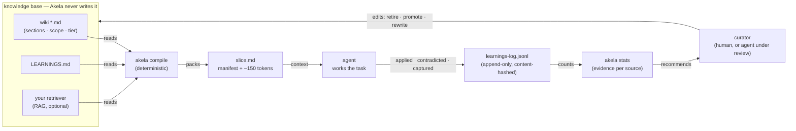
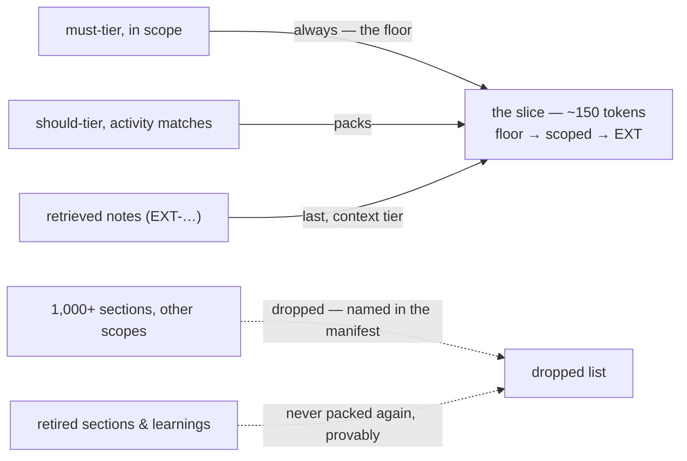
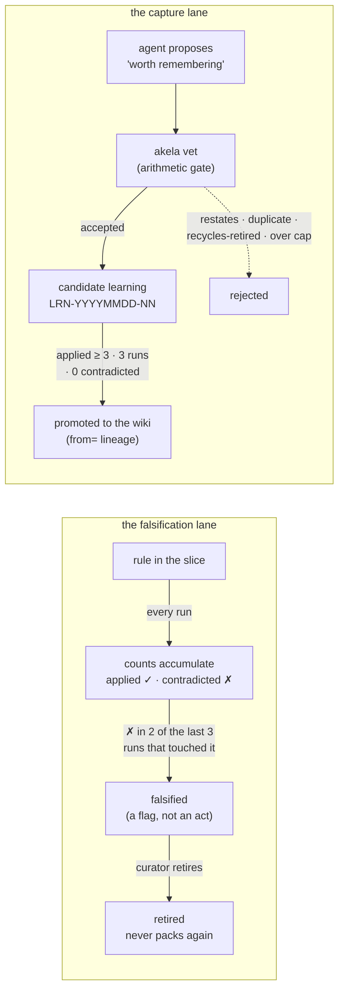
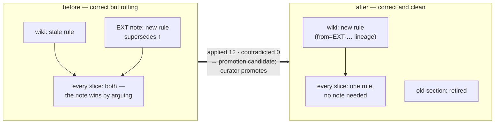

# How Akela works

Four mechanisms, one diagram each: the evidence loop, context selection, the life of a rule, and how retrieved notes graduate into your wiki.

## 1 · The loop: count everything, decide nothing

Akela is a clerk between your knowledge base and your agent. It reads, packs, and counts — the **only** hand that writes the knowledge base is the curator's, and only after reading the counts.

One direction of trust: the compiler reads, the agent reports, the log accumulates, stats counts, the curator decides. Every step left of the curator is bookkeeping. The experiments' central finding lives on this picture: the loop can verify that evidence is *honest* (quotes checked, blame attributed to the exact text delivered) — only the curator can know whether it is *right*.

## 2 · Selection: a 365k-token library, a 150-token slice

Selection is set logic over human-authored tags — no embeddings, no similarity, no LLM step. The request declares an activity (`akela compile --activity refund --task PRO-refund-004`); sections declare scope and tier.

The slice is the same ~150 tokens whether the library is 36k or 365k tokens — measured across a 10× scaling run. Everything *not* packed is still listed in the manifest, which is what makes staleness provable: you can always answer "was the old rule in front of the model?" with a file, not a guess.

## 3 · The life of a rule: from capture to canon — or to a tombstone

Three details carry the design's history:

- **Falsification is a recency test** — contradicted in two of the last three runs that touched the rule — because rules that are always in context never stop being `applied`, so the naive "distrusted and disused" rule can never fire on the knowledge that matters most.
- **The vet gate is set arithmetic** (token containment, duplicate detection, dead-value tombstones, a hard cap). A capable model can out-argue a prose rule like "only capture what the wiki doesn't say"; it cannot out-argue set intersection.
- **Evidence is version-scoped.** Blame binds to the content hash a run actually saw. When a human rewrites a section, the rewrite starts with a clean record and the old text's blame is set aside as `prior_versions` — a fresh correction is not punished for its predecessor's sins. And a promoted learning carries `from=` lineage, so it dies with its source instead of surviving it.

The measured caveat sits on the promotion arrow: a vague hedge can satisfy `applied ≥ 3 · 0 contradicted` honestly — it gets packed, therefore cited, and is too fuzzy to contradict. Which is why that arrow ends at a curator, not a script.

## 4 · RAG: a retrieved note is a claim, and claims can graduate

Plain RAG pastes similar text into context, forever. Akela treats every retrieved chunk as an addressable claim with a performance record — and when the record is earned, the claim becomes canon.

The left panel is most production RAG systems: answers look right precisely because retrieval papers over the rot, and no standard metric shows the stale rule sitting in nearly every context. Akela's manifest makes it visible, its counts make the fix earnable, and the promotion path makes retrieval what it should be: **how truth travels — while the wiki stays where truth lives.**

---

Every mechanism above is deterministic — no model, no embeddings, no tunable scores — so the same inputs always compile the same slice, and every change in what an agent sees traces to a visible edit or a counted line. The one thing none of these diagrams contains is a box that knows whether a rule is *true*. That box is the curator, and our replication experiments say it cannot be removed.
