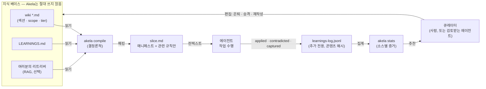
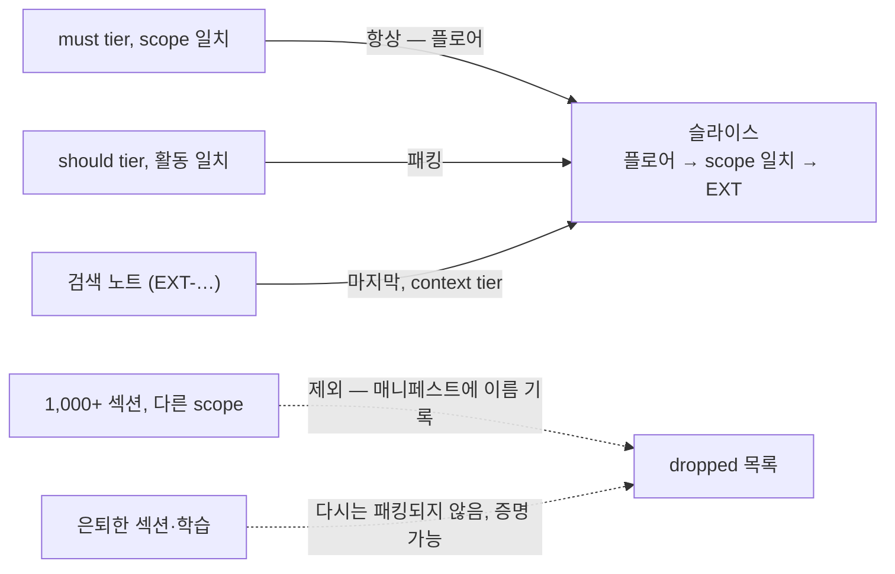
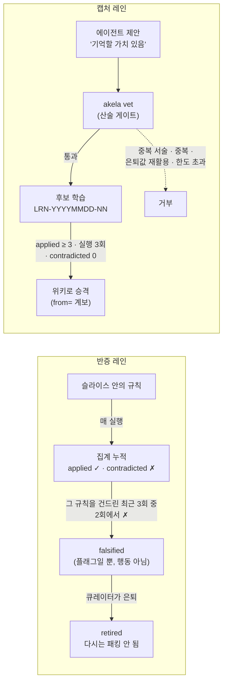
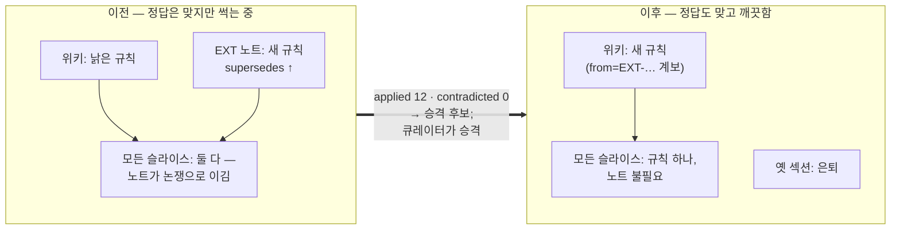

# Akela의 작동 원리

> [how-akela-works.md](../how-akela-works.md)(영어)의 한국어판입니다. 내용이 다를 경우 영어판이 기준입니다.

네 가지 메커니즘, 각각 다이어그램 하나: 증거 루프, 컨텍스트 선택, 규칙의 일생, 그리고 검색 노트가 위키로 졸업하는 방법.

## 1 · 루프: 모든 것을 집계하고, 아무것도 결정하지 않는다

Akela는 지식 베이스와 에이전트 사이의 서기(clerk)입니다. 읽고, 패킹하고, 집계합니다 — 지식 베이스에 쓰는 **유일한** 손은 큐레이터의 것이고, 그것도 수치를 읽은 후에만입니다.

신뢰는 한 방향입니다: 컴파일러는 읽고, 에이전트는 보고하고, 로그는 쌓이고, stats는 집계하고, 큐레이터가 결정합니다. 큐레이터 왼쪽의 모든 단계는 장부 기록입니다. 실험의 핵심 발견이 이 그림 위에 있습니다: 루프는 증거가 *정직한지*는 검증할 수 있지만(인용 검사, 실제로 전달된 텍스트에 비난 귀속) — 그것이 *옳은지*는 큐레이터만 알 수 있습니다.

## 2 · 선택: 365k 토큰 라이브러리, 150토큰 슬라이스

선택은 사람이 작성한 태그 위의 집합 연산입니다 — 임베딩도, 유사도도, LLM 단계도 없습니다. 요청이 활동을 선언하고(`akela compile --activity refund --task PRO-refund-004`), 섹션이 scope와 tier를 선언합니다.

라이브러리가 36k 토큰이든 365k 토큰이든 슬라이스는 같은 크기입니다(저희 10× 스케일링 실험에서 작업당 ~150토큰으로 측정; 크기는 위키가 아니라 작업 관련 규칙 수에 비례합니다). 패킹되지 *않은* 모든 것도 매니페스트에 남습니다 — 낡음을 증명 가능하게 만드는 것이 바로 이것입니다. "옛 규칙이 모델 눈앞에 있었는가?"에 언제나 추측이 아닌 파일로 답할 수 있습니다.

## 3 · 규칙의 일생: 캡처에서 정본으로 — 또는 툼스톤으로

설계의 역사를 담은 세 가지 디테일:

- **반증은 최근성 검사입니다** — 그 규칙을 건드린 최근 3회 실행 중 2회에서 반박 — 항상 컨텍스트에 있는 규칙은 `applied`가 멈추지 않아서, "불신되어 안 쓰이게 됨"이라는 순진한 기준으로는 정작 가장 중요한 지식에서 반증이 영영 발동하지 않기 때문입니다.
- **vet 게이트는 집합 산술입니다**(토큰 포함률, 중복 탐지, 사망값 툼스톤, 회당 상한). "위키에 없는 것만 캡처하라" 같은 문장 규칙은 유능한 모델이 말로 이겨 버립니다. 집합 교집합은 말로 이길 수 없습니다.
- **증거는 버전 범위화됩니다.** 비난은 실행이 실제로 본 콘텐츠 해시에 귀속됩니다. 사람이 섹션을 다시 쓰면 새 텍스트는 깨끗한 기록으로 시작하고, 옛 텍스트의 비난은 `prior_versions`로 따로 보관됩니다 — 신선한 수정이 전임자의 죄로 처벌받지 않습니다. 승격된 학습은 `from=` 계보를 갖고 있어 소스보다 오래 살아남는 대신 소스와 함께 죽습니다.

측정된 주의 사항이 승격 화살표 위에 있습니다: 모호한 헤지도 `applied ≥ 3 · contradicted 0`을 정직하게 만족할 수 있습니다 — 패킹되니까 인용되고, 모호하니까 반박당하지 않습니다. 그래서 그 화살표는 스크립트가 아니라 큐레이터에서 끝납니다.

## 4 · RAG: 검색 노트는 주장이고, 주장은 졸업할 수 있다

평범한 RAG는 비슷한 텍스트를 컨텍스트에 붙여 넣습니다. 영원히요. Akela는 모든 검색 청크를 성적 기록이 있는 주소화된 주장으로 취급하고 — 기록이 쌓이면 그 주장은 정본이 됩니다.

왼쪽 패널이 대부분의 프로덕션 RAG 시스템입니다. 검색이 썩음을 발라 덮기 때문에 정답이 맞아 보이고, 낡은 규칙이 거의 모든 컨텍스트에 실려 있다는 사실은 어떤 표준 지표에도 잡히지 않습니다. Akela의 매니페스트가 그것을 보이게 만들고, 집계가 수정을 획득 가능하게 만들며, 승격 경로가 검색을 제자리로 돌려놓습니다: **검색은 진실이 이동하는 방법이고, 위키는 진실이 사는 곳입니다.**

---

위의 모든 메커니즘은 결정론적입니다 — 모델도, 임베딩도, 조정 가능한 점수도 없습니다. 같은 입력은 언제나 같은 슬라이스를 컴파일하고, 에이전트가 보는 것의 모든 변화는 눈에 보이는 편집 또는 집계된 이벤트로 추적됩니다. 이 다이어그램들 어디에도 없는 단 하나의 상자는 규칙이 *참인지* 아는 상자입니다. 그 상자가 큐레이터이고, 저희 복제 실험은 그것을 제거할 수 없다고 말합니다.
